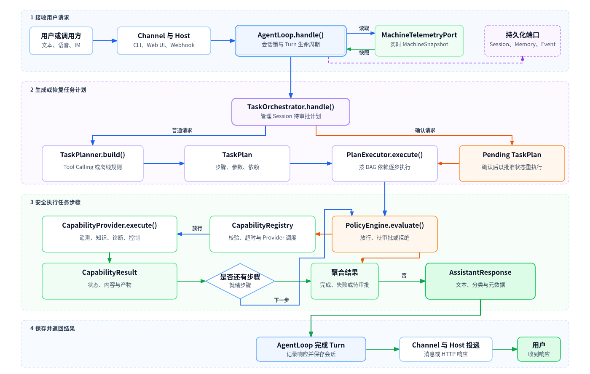
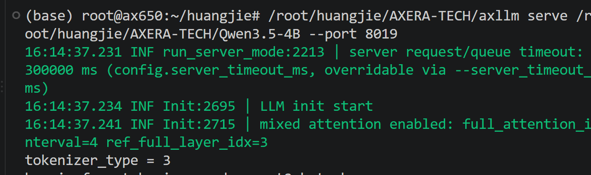
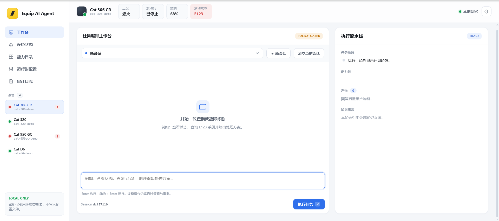

# Equip AI Agent（工程设备边缘AI智能助手）


---

 Equip AI Agent 是一款面向工程设备现场的智能体助手，可完全离线运行、数据不出场。只需用自然语言发问，即可完成设备状态查询、故障诊断与处置建议；方案经确认后执行，执行后自动复核。从"发现异常"到"恢复生产"，全流程在一轮对话里闭环。

- **问一句，状态即答** —— 燃油、工时、故障码、保养周期，一句话说清
- **查故障，有据可依** —— 检索本地设备手册，结论附出处与置信度
- **给方案，确认后执行** —— 处置步骤经确认后执行，完成后自动复核

 https://github.com/user-attachments/assets/e52ab720-df94-4b74-8edb-1446c7eb79ea

---

## 目录

- [Equip AI Agent（工程设备边缘AI智能助手）](#equip-ai-agent工程设备边缘ai智能助手)
  - [目录](#目录)
  - [项目背景](#项目背景)
    - [目前现状](#目前现状)
    - [本项目的解决思路](#本项目的解决思路)
    - [技术路线选型](#技术路线选型)
    - [应用场景](#应用场景)
  - [核心特性](#核心特性)
    - [🚀 功能特性](#-功能特性)
    - [🔧 技术特性](#-技术特性)
  - [系统架构](#系统架构)
    - [架构总览](#架构总览)
    - [分层职责](#分层职责)
    - [文件目录](#文件目录)
    - [任务编排](#任务编排)
    - [上下文与记忆](#上下文与记忆)
    - [能力系统](#能力系统)
      - [内置能力清单](#内置能力清单)
  - [快速开始](#快速开始)
    - [1. 安装](#1-安装)
    - [2. CLI 演示](#2-cli-演示)
    - [3. 本地调试 UI](#3-本地调试-ui)
    - [4. 运行确定性故障模拟](#4-运行确定性故障模拟)
    - [5. 运行测试](#5-运行测试)
  - [使用指南](#使用指南)
    - [模型接入](#模型接入)
    - [配置参考](#配置参考)
    - [调试 UI](#调试-ui)
    - [IM 渠道接入](#im-渠道接入)
    - [语音网关](#语音网关)
    - [插件系统](#插件系统)
  - [AX8850 运行示例](#ax8850-运行示例)

---

## 项目背景

### 目前现状

工程机械的现场运维长期依赖"老师傅经验 + 纸质手册 + 专家到场"：

- **故障响应慢** — 设备异常时操作员只能凭经验判断，疑难故障要等专家到场或远程会诊，停机时间被不断拉长。
- **资料查找难** — 维修手册、安全公告、保养计划分散在纸质文档或不同系统里，现场难以按机型/故障码快速检索。
- **经验难沉淀** — 老师傅的诊断经验随人员流动流失，新人上手周期长。
- **现场网络受限** — 矿山、工地等作业现场网络不稳定，依赖云端的方案经常不可用，设备数据上传还有隐私顾虑。

### 本项目的解决思路

Equip AI Agent 把"问状态、查故障、给方案"装进一台部署在设备侧的助手，操作员用日常聊天工具就能完成从发现异常到恢复生产的完整闭环：

- 🔒 **完全离线运行** — 状态查询、故障检索、诊断分析全流程在设备侧完成，不依赖云端，数据不出设备。
- 💬 **自然语言入口** — 操作员在 QQ / 微信 / Telegram 等常用 IM 或语音入口直接用自然语言提问，无需学习新系统。
- 🔁 **任务闭环** — 观测 → 检索 → 诊断 → 方案 → 人工确认 → 执行 → 复核，全流程在对话中完成，处置动作必须经操作员确认。
- 🧾 **结论可追溯** — 每条诊断结论附手册出处与置信度，关键过程全程留痕，可回放、可审计。

### 技术路线选型

| 环节 | 选型 | 考量 |
|------|------|------|
| 语言模型 | `DemoRuleBasedModel`（离线规则）/ OpenAI 兼容端点（vLLM / Ollama / AXLLM） | 无模型开箱即用；接入真实模型获得 LLM 规划能力 |
| 任务规划 | 规则规划 + LLM Tool Calling 双路线 | LLM 规划失败自动退回离线规则，边缘小模型也可用 |
| 知识检索 | 本地手册，按机型/故障码加权检索 | 离线可用，答案附出处 |
| 推理框架 | axllm / vLLM / Ollama（OpenAI 兼容 API） | 统一 `/chat/completions` 接口，可对接任意兼容服务 |
| 数据存储 | JSONL 追加式存储（原型实现） | 零第三方依赖；生产环境可替换为 SQLite 或独立服务 |
| 硬件平台 | 可选 AXera AXLLM 边缘 NPU | 4B 级端侧模型部署，已针对边缘推理运行时适配 |

### 应用场景

| 领域 | 典型场景 | 核心价值 |
|------|----------|----------|
| 🏗️ **工程机械运维** | 现场设备状态问答、故障初诊、处置建议 | 操作员自助排查，缩短停机时间 |
| 🚚 **机队管理** | 多设备状态汇总、保养提醒、风险优先级排序 | 一个入口管理分散在现场的各台设备 |
| 🎓 **新人带教** | 按机型/故障码检索手册、故障场景演练 | 老师傅经验沉淀为可检索的知识 |
| 📞 **远程支持** | 专家通过 IM 渠道接入，基于证据链给出建议 | 减少专家到场成本，加速疑难故障处理 |

---

## 核心特性

### 🚀 功能特性

- **设备状态问答** —— 实时读取遥测快照，生成可读状态摘要；简单事实查询走确定性快速通道，不经过生成模型
- **本地知识检索** —— 按机型/故障码检索本地手册，回答引用来源，离线可用
- **诊断分析** —— `diagnostic.agent` 汇聚遥测、操作员报告与手册证据，生成有界诊断结论
- **处置建议与审批** —— `action.propose` 生成操作员审阅的处置方案，用户确认后按同一计划执行
- **多 IM 渠道** —— QQ / 微信 / Telegram / Discord / Slack / 飞书 / 钉钉，webhook 免 SDK 接入
- **语音网关** —— 替换 ASR/TTS 两个端口即可接入语音交互，低置信度自动返回澄清话术

### 🔧 技术特性

- **离线规则模型兜底** —— 无模型配置时自动使用内置 `DemoRuleBasedModel`，全部功能开箱即用
- **六边形架构** —— 端口定义在领域层，遥测/知识/模型/存储等任何 Adapter 可整体替换
- **DAG 任务编排** —— `TaskPlan` 步骤依赖图 + `PlanExecutor` 逐步执行，Tool Calling 规划失败自动退回规则规划
- **边缘运行时适配** —— 自动剥离 `<think>` 推理、截断越轮输出、从纯文本恢复 `<tool_call>`，适配 AXLLM / llama.cpp 等边缘推理端点
- **Artifact 证据链** —— 步骤间传递带来源/置信度/观测时间的 `Artifact`，而非拼接文本
- **声明式能力发现** —— Provider 通过 `auto_select` + `trigger_terms` 声明条件，Planner 零硬编码分支
- **插件系统** —— 按归属方跟踪资源，依赖检查与受控卸载，支持配置驱动加载
- **全程审计** —— 关键过程追加写入事件日志，支持回放、评测与故障追溯


---

## 系统架构

### 架构总览



主链路遵循"**接入 → Turn 边界 → 计划 → 逐步执行 → 响应投递**"：

**用户请求 → AgentLoop（实时 MachineSnapshot）→ TaskOrchestrator → TaskPlanner 生成 TaskPlan → PlanExecutor（PolicyEngine 检查 → CapabilityRegistry 调度 → Provider 执行 → 收集 Artifact）→ AssistantResponse → 渠道投递**

普通请求由 `TaskPlanner` 生成新的 `TaskPlan`；确认请求沿用同一 Session 中暂存的计划，以 `approved=true` 重新执行。实时遥测是设备状态的权威来源，会话历史与长期记忆仅作上下文提示。

### 分层职责

| 层 | 目录 | 职责 | 关键类型 |
|---|---|---|---|
| 领域层 | [domain/](src/cat_assistant/domain/) | 端口与纯数据模型，无任何实现细节 | `MachineTelemetryPort`、`KnowledgePort`、`LanguageModelPort`、`CapabilityDescriptor`、`Artifact` |
| 应用层 | [application/](src/cat_assistant/application/) | 循环、编排、策略、上下文与生命周期 | `AgentLoop`、`TaskOrchestrator`、`PolicyEngine`、`BoundedAgentRunner`、`CapabilityRegistry`、`PluginManager` |
| 适配层 | [adapters/](src/cat_assistant/adapters/) | 端口的具体实现，可整体替换 | `OpenAICompatibleModel`、`ScenarioTelemetry`、`JsonlEventStore`、内置能力 Provider |
| 接入层 | [channels/](src/cat_assistant/channels/) | 各 IM 平台的收/发适配 | `OneBotV11Channel`、`WeChatWebhookChannel`、`WebhookServer`、`ChannelBridge` |

### 文件目录

```text
src/cat_assistant/
├── domain/              # 端口与核心模型，无外部依赖
│   ├── ports.py         # 遥测 / 知识 / 会话 / 记忆 / 模型 / 事件 / 语音 / 追踪端口
│   ├── models.py        # Utterance、MachineSnapshot、TurnRecord、DomainEvent …
│   ├── capabilities.py  # CapabilityDescriptor、Artifact、CapabilityResult
│   └── plans.py         # TaskStep、TaskPlan、StepResult
├── application/         # 编排与策略
│   ├── loop.py          # AgentLoop：外层循环、会话锁、超时、持久化
│   ├── orchestration.py # TaskPlanner / PlanExecutor / PolicyEngine / TaskOrchestrator
│   ├── runner.py        # BoundedAgentRunner：有界内层循环
│   ├── capabilities.py  # CapabilityRegistry + Schema 校验
│   ├── context.py       # ContextBuilder：有界上下文组装
│   ├── tools.py         # ToolRegistry：只读白名单工具
│   ├── plugins.py       # PluginManager / PluginContext / ServiceRegistry
│   ├── query.py         # DeterministicQueryService：确定性快速通道
│   ├── voice.py         # VoiceGateway：语音边界
│   ├── events.py        # EventRecorder：审计事件记录
│   └── tracing.py       # Tracer / TraceNode 端口实现与 span() 上下文管理
├── adapters/            # 端口实现（可替换）
│   ├── model.py         # DemoRuleBasedModel / OpenAICompatibleModel
│   ├── telemetry.py     # InMemoryTelemetry（4 台演示设备）
│   ├── simulation.py    # 3 个确定性故障场景 + ScenarioTelemetry
│   ├── knowledge.py     # InMemoryKnowledge：故障码加权检索
│   ├── memory.py        # JsonlSessionStore / JsonlMemoryStore
│   ├── capabilities.py  # 8 个内置能力 Provider
│   ├── control.py       # SimulatedMachineControl：机器控制占位执行器
│   ├── tools.py         # MachineStatusTool / ManualSearchTool：只读诊断工具
│   ├── plugins.py       # 内置插件：cat.readonly-equipment-tools
│   ├── speech.py        # Utf8TestRecognizer / Utf8TestSynthesizer：语音端口测试实现
│   ├── tracing.py       # LangfuseTracer / TracedLanguageModel / RecordingTracer
│   ├── runtime_config.py# 原子 JSON 配置存储与校验
│   └── events.py        # JsonlEventStore
├── channels/            # QQ / 微信 / Telegram / Discord / Slack / 飞书 / 钉钉 + WebhookServer
├── ui/                  # 调试 UI 静态资源
├── bootstrap.py         # 组合根：build_demo_app()
├── __main__.py          # CLI 入口（equip）
└── debug_ui.py          # 调试 UI 入口（equip-ui）
config/                  # runtime-config（含 axllm 模板）与 cloudflared 配置模板
docs/architecture.md     # 架构说明与设计决策
scripts/                 # qq-channel.py、cloudflare-tunnel.sh
tests/                   # 99 项测试
```

### 任务编排

请求先由 Planner 拆解成 `TaskPlan`（一个小的步骤依赖 DAG），再由 `PlanExecutor` 按依赖顺序执行。典型步骤链：

```text
observe → retrieve → infer → propose → approve → act → verify
```

- **ToolCallingTaskPlanner**（默认路线）：把所有已启用能力的名称、描述与输入 Schema 映射为模型可用的 Function Tools，由 LLM 挑选完成请求所需的最小工具集合并给出参数；这些调用先转换为顺序依赖的 `TaskStep` DAG。模型无响应、未选择任何能力或返回未知工具时，自动退回规则规划器。
- **RuleBasedTaskPlanner**（离线路线）：基于关键词与能力注册表的 `auto_select` / `trigger_terms` 发现机制分解请求，无模型也完整可用。
- 例如"查看当前状态，查询 E123 手册，给出方案，确认后停机"会形成：

```text
telemetry.read → telemetry.summarize → knowledge.search
→ diagnostic.agent → action.propose → 审批门 → machine.control → telemetry.read
```

### 上下文与记忆

四类信息严格分离处理，共同进入 `ContextBuilder`：

```text
MachineTelemetryPort ──▶ MachineSnapshot（当前权威事实）
SessionStorePort    ──▶ 最近 8 轮会话 Turn + 可选外部摘要
MemoryPort          ──▶ 按机器/操作员隔离的显式记忆
EventStorePort      ──▶ 不可变审计事件，不会自动回填进 Prompt
                            │
                     ContextBuilder（字符预算 12,000，逐层裁剪）
                            │
                     BoundedAgentRunner
```

- 超预算时优先丢弃最早的历史对话，系统规则与当前机器快照始终保留
- 记忆按机器/操作员隔离，标注为"非权威设备状态"，不覆盖实时遥测
- 模型不能自主写入长期记忆：`remember()` 只接受受信任流程校验过的 `MemoryRecord`；`clear_session()` 只清会话历史与摘要，显式记忆不受影响

### 能力系统

所有可扩展能力实现统一的 `CapabilityProvider` 契约：

```text
CapabilityProvider
  ├── descriptor   名称、版本、Schema、风险、来源、触发词、消费/产出类型
  ├── execute()    执行并返回 CapabilityResult（含 Artifact）
  ├── startup()    可选启动钩子，由 Registry 调用且保证只调用一次
  ├── shutdown()   可选关闭钩子，应用关闭时全部执行
  └── health()     可选健康检查
```

`CapabilityRegistry` 负责注册、启停、按归属方（owner）卸载、Schema 校验、超时与机型适配检查；`enabled` 与 `started` 独立——注册不建立连接，`start_all()` 或首次执行前才真正启动。`model_selectable=False` 的能力（管道步骤、确定性回答、niche 观察器）保持可用但不进入模型工具菜单，让边缘小模型面对更短的工具列表。

步骤之间不传递任意 Python 返回值或拼接文本，而是传递带来源的 `Artifact`：

```text
Artifact
  ├── artifact_type      领域含义（如 machine_snapshot、indicator_report）
  ├── data               载荷
  ├── source_capability  产生者
  ├── confidence         置信度
  ├── provenance         来源说明（传感器 / 操作员 / 手册）
  └── observed_at        观测时间
```

Planner 无 `if capability == ...` 硬编码分支：Provider 通过 `auto_select` + `trigger_terms` 声明发现条件。如操作员说"指示灯亮、报警声响"，`observation.user_report` 自动生成置信度 0.5 的 `indicator_report` 与 `audio_alarm_report`；未来接入真实传感器后，注册相同领域含义、更高置信度的 Provider 即可自动插入证据链，无需改 Planner。

#### 内置能力清单

| 能力 | kind | 说明 | 关键属性 |
|---|---|---|---|
| `telemetry.read` | observe | 读取本轮权威设备快照 | 产出 `machine_snapshot` |
| `telemetry.summarize` | infer | 生成可读状态摘要 | 对用户可见 |
| `observation.user_report` | observe | 采集操作员报告的视/听症状 | `auto_select`，置信度 0.5，非权威 |
| `knowledge.search` | retrieve | 按机型/故障码检索本地手册 | `auto_select`（故障/问题触发词），产出 `knowledge_evidence` |
| `response.compose` | summarize | 简单事实的确定性快速通道 | 不经过生成模型 |
| `diagnostic.agent` | infer | 汇聚证据生成有界诊断 | 超时绑定整轮预算 `turn_timeout_seconds`（默认 120s），内部调用 `BoundedAgentRunner` |
| `action.propose` | propose | 生成操作员审阅的处置方案 | 消费 `diagnostic_assessment` |
| `machine.control` | act | 经 Safety Gateway 改变设备状态 | 风险 critical，需审批，当前为占位执行器 |

带副作用的能力由 `PolicyEngine` 执行前校验：未获批准一律返回 `approval_required`，计划按 Session 暂存，用户回复"确认 / 同意 / yes / proceed"后以 `approved=true` 重跑。`machine.control` 由 `SimulatedMachineControl` 占位执行器承接：`apply()` 返回 `ControlOutcome`，确认后携带新 `MachineSnapshot` 写回内存遥测；未接入执行器（如场景回放模式）时默认拒绝写入。


---

## 快速开始

### 1. 安装

```bash
pip install -e .
```

### 2. CLI 演示

```bash
# 无模型配置时自动使用内置规则模型，完全离线
equip
```

### 3. 本地调试 UI

```bash
# 启动后访问 http://127.0.0.1:8765/
equip-ui
```

### 4. 运行确定性故障模拟

```bash
equip-ui --scenario hydraulic-pressure-drift
equip-ui --scenario coolant-overheat --phase 2
equip-ui --scenario fuel-and-service-due
```

### 5. 运行测试

```bash
PYTHONPATH=src pytest tests/     # 99 passed
```

---

## 使用指南

模型接入、运行配置、调试控制台、IM 渠道、语音网关与插件开发的使用说明。

### 模型接入

模型通过 `LanguageModelPort` 接口接入，内置两种实现：

- **`DemoRuleBasedModel`** —— 离线规则模型，检索本地知识并引用来源，无任何外部依赖，默认启用
- **`OpenAICompatibleModel`** —— 纯标准库实现的 OpenAI 兼容 `/chat/completions` 客户端，支持 Function Calling，可对接 vLLM、Ollama、AXera AXLLM 或任何兼容端点

`provider` 支持的取值：

| provider | 默认 base_url | 说明 |
|---|---|---|
| `demo` | — | 离线规则模型，无需部署 |
| `vllm` | `http://127.0.0.1:8000/v1` | vLLM 推理服务 |
| `ollama` | `http://127.0.0.1:11434/v1` | 本地 Ollama |
| `openai_compatible` | 需显式配置 | 任意 OpenAI 兼容端点 |
| `axllm` | 需显式配置 | AXera AXLLM 边缘推理（爱芯边缘 · Qwen），运行示例见 [AX8850 运行示例](#ax8850-运行示例) |

针对边缘推理运行时的适配（`OpenAICompatibleModel` 内置）：

- **`disable_thinking`** —— 在系统提示注入 Qwen3 `/no_think` 软开关，跳过思考阶段（对不识别该指令的模型无副作用）
- **`stop`** —— 显式下发停止词：边缘运行时经常漏注册 `<|im_end|>` 停止词，模型会越过本轮回合并开始生成下一轮 ChatML，停止词可截断这类失控输出
- **越轮输出截断** —— 响应中出现 `<|im_start|>` / `<|im_end|>` / `<|endoftext|>` 时只保留第一个控制符之前的文本，伪造的下一轮不会到达操作员或诊断上下文
- **纯文本工具调用恢复** —— AXLLM、llama.cpp 或未启用 tool-call 解析的 vLLM 常把 `<tool_call>` 块以纯文本形式放进 `content`；结构化 `tool_calls` 为空时自动从文本恢复调用，畸形块静默跳过并降级为"未选择能力"
- **`finish_reason` 与 `usage` 审计** —— 记录停止原因与 token 用量（含 `reasoning_tokens`），可分辨"模型耗尽预算思考而未产出工具调用"（`finish_reason=length`）这类边缘故障

`planning_mode` 三种取值：

| 模式 | 行为 |
|---|---|
| `auto` | 配置了非 demo 模型时走 Tool Calling 规划，否则规则规划 |
| `tool_call` | 强制 Tool Calling 规划（模型异常时仍退回规则规划） |
| `rule` | 始终使用离线规则规划器 |


### 配置参考

默认读取 `runtime/runtime-config.json`，模板见 [config/runtime-config.example.json](config/runtime-config.example.json)。完整配置项：

```json
{
  "version": 1,
  "model": {
    "provider": "demo",              // demo | vllm | ollama | openai_compatible | axllm
    "model": "Qwen/Qwen3-4B",
    "base_url": "http://127.0.0.1:8000/v1",
    "api_key": "",
    "api_key_env": "CAT_API_KEY",    // 密钥建议引用环境变量名，配置中不保存明文密钥
    "temperature": 0.1,
    "max_tokens": 1024,
    "timeout_seconds": 30,
    "max_steps": 4,                  // 1–12
    "planning_mode": "auto",         // auto | tool_call | rule
    "disable_thinking": false,       // 注入 Qwen3 /no_think 软开关
    "stop": [],                      // 停止词，如 ["<|im_end|>", "<|im_start|>"]
    "model_call_timeout_seconds": 60.0,
    "tool_call_timeout_seconds": 30.0,
    "turn_timeout_seconds": 120.0
  },
  "mcp_servers": [                   // transport: streamable_http | sse | stdio
    { "id": "mcp-1", "name": "docs", "transport": "stdio",
      "command": "mcp-server", "arguments": [], "env_keys": ["MCP_TOKEN"],
      "tool_allowlist": ["*"], "enabled": false }
  ],
  "plugins": [
    { "id": "plugin-1", "name": "my-plugin", "version": "1.0.0",
      "reference": "my_package.module:factory", "config": {}, "enabled": false }
  ]
}
```

`RuntimeConfigStore` 提供原子读写（临时文件 + rename）与逐字段校验；保存的是声明，而不是正在运行的实例——配置中的 MCP / 插件在宿主校验并加载前一直处于"configured"（已配置）状态。远程 MCP（`streamable_http` / `sse`）需要 `endpoint`，`stdio` 需要 `command`。

### 调试 UI

`equip-ui` 启动零依赖本地 Web 控制台（默认 `http://127.0.0.1:8765/`），支持对话、事件流查看、场景切换/推进、模型与 MCP/插件配置编辑（模型参数含 `provider`、`disable_thinking`、`stop` 等）：

| 接口 | 说明 |
|---|---|
| `GET /api/health` | 健康检查 |
| `GET /api/state` | 运行时状态（模型适配器、能力清单等） |
| `GET /api/events` | 读取审计事件流 |
| `GET /api/simulations` / `/api/machines` | 场景目录 / 设备列表 |
| `GET /api/config` | 读取运行时配置 |
| `POST /api/turn` | 发送一轮对话 |
| `POST /api/remember` | 写入显式记忆 |
| `POST /api/session/delete` | 清除会话 |
| `POST /api/config/model` `/mcp` `/plugin` | 保存配置（含删除接口） |

UI 静态资源在 [ui/](src/cat_assistant/ui/)（`index.html` / `app.js` / `style.css`）。远程分享可用 [scripts/cloudflare-tunnel.sh](scripts/cloudflare-tunnel.sh)：`quick` 模式走临时隧道，`named` 模式需要 `CLOUDFLARE_TUNNEL_TOKEN`，生产环境建议命名隧道 + Access 访问策略。

### IM 渠道接入

所有渠道适配器实现 `MessageChannel`（`handle_update` + `send_text`），经 `ChannelBridge` 接入 `AgentLoop`。会话隔离策略：`session_id = channel:chat_id`，`operator_id = channel:sender_id`，历史不会在用户之间泄漏；`machine_id` 可以是固定设备，也可以传入一个按消息动态解析的函数。

| 渠道 | 类 | 说明 |
|---|---|---|
| QQ | `OneBotV11Channel` | OneBot v11 HTTP 反向事件，群聊/私聊，免 SDK |
| 微信 | `WeChatWebhookChannel` | 企业微信机器人 webhook / 自建网关（可注入自定义发送器 sender） |
| Telegram / Discord / Slack / 飞书 / 钉钉 | 对应 Channel 类 | webhook 出站 + `WebhookServer` 入站 |

`WebhookServer` 是零依赖的 JSON webhook 服务端，把 `/qq`、`/wechat` 等任意路径路由到渠道适配器；默认只绑定 `127.0.0.1`，暴露公网前必须在反向代理层加认证与 TLS。

QQ 接入示例：

```bash
ONEBOT_API_URL=http://127.0.0.1:5700 \
ONEBOT_TOKEN=... \
CAT_MACHINE_ID=cat-306-demo \
CAT_CONFIG_PATH=runtime/runtime-config.json \
python scripts/qq-channel.py
# webhook: http://127.0.0.1:8088/qq （在 OneBot 端配置反向 HTTP 事件指向此地址）
```

### 语音网关

`VoiceGateway` 是语音输入的接入层：`SpeechRecognizerPort.transcribe()` → 置信度低于 0.65 时返回澄清话术 → 否则走 `AgentLoop.handle()` → `SpeechSynthesizerPort.synthesize()` 合成语音。替换两个语音端口即可接入 NVIDIA Riva 流式 ASR/TTS，无需改动循环与编排。

### 插件系统

插件实现 `Plugin` 契约（`manifest` + `register()` + `shutdown()`），由 `PluginManager` 统一管理加载、依赖检查与卸载：

```python
manifest = PluginManifest(
    name="my.capability-plugin",
    version="1.0.0",
    description="...",
    dependencies=(),          # 依赖未加载则拒绝加载
)

def register(self, context: PluginContext) -> None:
    # context.tools / context.capabilities / context.services / context.events
    context.capabilities.register(MyProvider(), owner=self.manifest.name)
```

- 资源按归属方跟踪：插件卸载时先关闭其 Provider 再移除；仍有插件依赖它时不允许卸载
- `PluginManager.load_object("package.module:factory")` 支持配置驱动的插件加载；入口点组为 `cat_assistant.plugins`（生产环境应使用显式白名单）
- 内置插件 `cat.readonly-equipment-tools` 提供 `get_machine_status` 与 `search_manual` 两个只读诊断工具


---

## AX8850 运行示例

AX8850 上运行 Equip AI Agent 有两种方式：

- **分离部署** —— AX8850 只跑 AXLLM 推理服务，Equip AI Agent 运行在同网主机上，`base_url` 指向 AX8850 的局域网地址（适合开发调试）
- **全量部署** —— Equip AI Agent 本体与推理服务同机运行在 AX8850 上，`base_url` 指向 `127.0.0.1`，状态查询、诊断、处置全流程离线闭环

1.下载模型
[Qwen3.5-4B](https://modelscope.cn/models/AXERA-TECH/Qwen3.5-4B-AX650-GPTQ-Int4-C256-P16k-CTX20k)

2.在 AX8850 侧启动推理服务（OpenAI 兼容 `/v1/chat/completions`）：

```bash

axllm serve /path/to/Qwen3-4B --host 0.0.0.0 --port 8000
```



3.将 [config/runtime-config.axllm.example.json](config/runtime-config.axllm.example.json) 复制为 `runtime/runtime-config.json`，按需修改后照常启动：

```json
{
  "version": 1,
  "model": {
    "provider": "axllm",
    "model": "Qwen3-4B",
    "base_url": "http://192.168.1.100:8000/v1",
    "planning_mode": "rule",
    "disable_thinking": true,
    "stop": ["<|im_end|>", "<|im_start|>"],
    "model_call_timeout_seconds": 90,
    "turn_timeout_seconds": 120
  },
  "mcp_servers": [],
  "plugins": []
}
```

4.启动
```bash
equip      # CLI 对话
equip-ui   # 调试 UI：http://127.0.0.1:8765/
```

- `base_url` —— 全量部署填 `http://127.0.0.1:8000/v1`，分离部署换成 AX8850 的局域网地址
- `model` —— 必须与 axllm 服务实际暴露的模型名一致
- `disable_thinking` / `stop` —— 边缘运行时适配，作用见上文"针对边缘推理运行时的适配"




